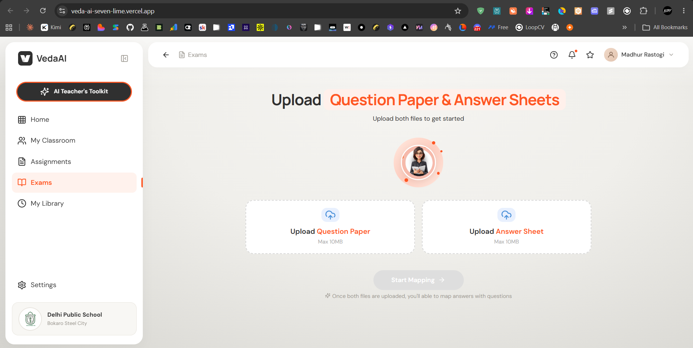
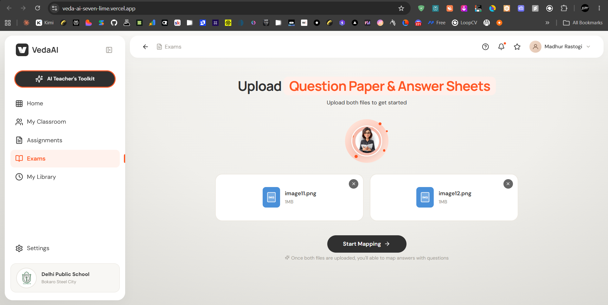
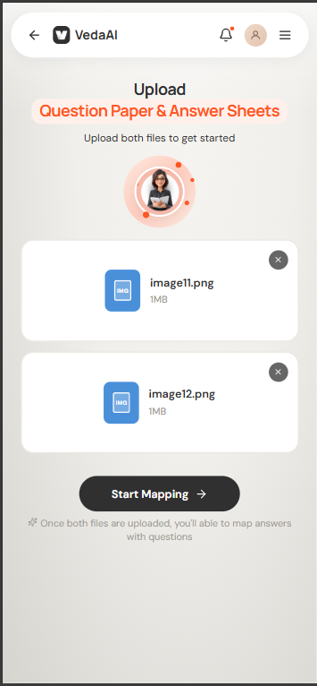
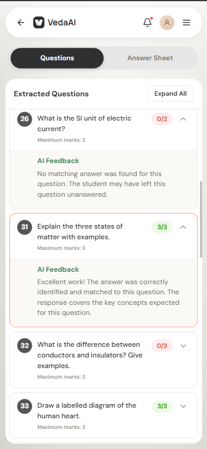
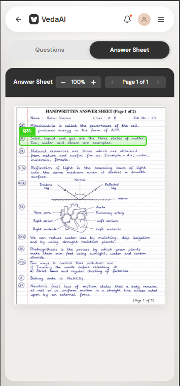
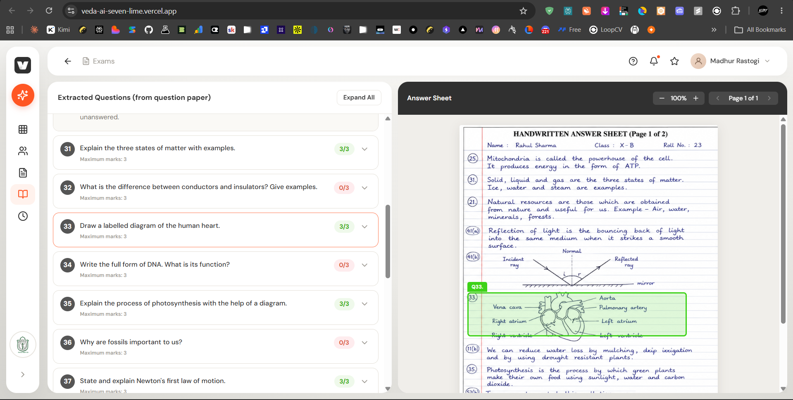

# VedaAI - AI-Powered Assessment Mapper

An AI-powered assessment tool that extracts questions from question papers, extracts handwritten answers, maps answers to questions, highlights answer regions, and grades responses using multiple AI providers.

## Live Demo

**Vercel Deployment:** [https://veda-ai-seven-lime.vercel.app/](https://veda-ai-seven-lime.vercel.app/)

## Screenshots

| Home Screen | Upload Screen (Laptop) | Upload Screen (Mobile) |
|---------------|---------------|---------|
|  |  |  |

| Question Extraction | Answer Extraction | Graded Results |
|---------------------|-------------------|----------------|
|  |  |  |

---

## Complete Pipeline Flow

### Phase 1: Question Extraction (Vision VLM)
- Upload question paper (PDF/PNG/JPG, max 10MB)
- Render PDF pages as images using PDF.js
- Send to Vision Language Model for extraction
- Extract: question number, text, marks, page, bounding box
- Preserve subparts: `11(a)`, `11(b)`, `41(a)(i)` as separate records

**Provider Fallback Chain:**
```
Ollama Gemma4 31B → Ollama MiniMax M3 → Gemini 3.5 Flash → Groq →
NaraRouter StepFun → NaraRouter MiniMax → Monyet → Nemotron → NavyAI
```

### Phase 2: Answer Extraction (Vision VLM)
- Upload answer sheet (PDF/PNG/JPG, max 10MB)
- Extract handwritten answers with:
  - Answer text (max 500 chars)
  - Question number label
  - Bounding box coordinates `[x1, y1, x2, y2]` normalized 0-1
  - Confidence score
- Multi-page answers merged automatically

**Same provider chain as Phase 1.**

### Phase 3: Answer Mapping (Local Code)
- Match answers to questions using:
  - Exact number match (e.g., "25" → Q25)
  - Parent inference (e.g., "52(b)" → Q52b)
  - Semantic token overlap
  - Page context proximity
- Confidence scoring for each mapping
- Cross-answer violation detection

### Phase 3.5: AI Grading (Text-Only Model)
- After mapping, grade each answer against its question
- Uses extracted answer text (no vision needed)
- Awards marks from 0 to maximum
- Provides AI feedback for each answer
- Partial marks supported (e.g., 3/5, 1/3)

**Grading Fallback Chain:**
```
Groq Qwen 3.6-27B → Ollama Gemma4 31B → Ollama MiniMax M3 →
Monyet Gemini 3.5 Flash → NavyAI Gemini 2.5 Flash
```

### Phase 4: Quality Gate & OCR Recovery
- Evaluate extraction quality (questions, answers, bboxes)
- If quality low → trigger Nemotron OCR v2
- OCR provides geometry repair and text recovery
- Re-extract with OCR assistance if needed

---

## Features

- **Figma-Exact UI** - Pixel-perfect match to reference designs
- **Responsive Design** - Works on mobile (320px) to desktop (1440px)
- **PDF & Image Support** - Upload PDFs or images for both papers
- **AI Grading** - Automatic marking with partial marks support
- **Bounding Box Highlights** - Visual answer regions on the answer sheet
- **Multi-Page Support** - Handles multi-page PDFs with page navigation
- **Teacher Portrait** - Professional UI with AI teacher assistant avatar

---

## Tech Stack

- **Framework:** Next.js 15 (App Router)
- **Language:** TypeScript
- **Styling:** CSS Modules (globals.css)
- **PDF Rendering:** PDF.js
- **Validation:** Zod schemas
- **Deployment:** Vercel (Node.js runtime, 120s timeout)

---

## Provider Configuration

### Vision Models (Extraction)
| Provider | Model | API Key Env | Status |
|----------|-------|-------------|--------|
| Ollama Cloud | gemma4:31b | OLLAMA_CLOUD_API_KEY | Active |
| Ollama Cloud | minimax-m3 | OLLAMA_CLOUD_API_KEY | Active |
| Gemini | 3.5-flash | GEMINI_API_KEY | Active |
| Groq | qwen3.6-27b | GROQ_API_KEY | Active |
| NaraRouter | stepfun/minimax | NARAROUTER_API_KEY | Fallback |
| Monyet | gemini-3.5-flash | MONYET_API_KEY | Fallback |
| Nemotron | omni-30b | NVIDIA_API_KEY | Fallback |
| NavyAI | gemini-2.5-flash | NAVYAI_API_KEY | Last resort |

### Text Models (Grading)
| Provider | Model | Priority |
|----------|-------|----------|
| Groq | qwen/qwen3.6-27b | 1st |
| Ollama Cloud | gemma4:31b | 2nd |
| Ollama Cloud | minimax-m3 | 3rd |
| Monyet | gemini-3.5-flash | 4th |
| NavyAI | gemini-2.5-flash | 5th |

### OCR Engine
- **NVIDIA Nemotron OCR v2** - Specialized layout and geometry engine
- Runs conditionally for quality recovery only

---

## Environment Variables

All keys are server-side only. Never prefix with `NEXT_PUBLIC_`.

```env
# Vision/Extraction Providers
OLLAMA_CLOUD_API_KEY=your_ollama_key
GEMINI_API_KEY=your_gemini_key
GROQ_API_KEY=your_groq_key
NARAROUTER_API_KEY=your_nararouter_key
MONYET_API_KEY=your_monyet_key
NVIDIA_API_KEY=your_nvidia_key
NAVYAI_API_KEY=your_navyai_key

# OCR Engine
NVIDIA_OCR_API_KEY=your_nvidia_ocr_key
```

---

## Setup

```bash
npm install
cp .env.example .env.local
# Add your API keys to .env.local
npm run dev
```

Open [http://localhost:3000](http://localhost:3000).

---

## Commands

```bash
npm run dev          # Start development server
npm run build        # Production build
npm run test         # Run unit tests
npm run lint         # Lint code
```

---

## Project Structure

```
vedai/
├── app/
│   ├── api/extract/route.ts    # Extraction API endpoint
│   ├── globals.css              # All styles (Figma parity)
│   └── page.tsx                 # Main page
├── components/
│   └── assessment-workspace.tsx # Main UI component
├── lib/
│   ├── ai/
│   │   ├── provider.ts          # VLM providers, grading, prompts
│   │   ├── registry.ts          # Provider config and ordering
│   │   ├── openai-compatible.ts # OpenAI-compatible adapter
│   │   ├── gemini.ts            # Gemini adapter
│   │   ├── nemotron-ocr.ts      # OCR engine
│   │   └── ocr-quality.ts       # Quality evaluation
│   ├── mapping.ts               # Answer-to-question mapping
│   └── types.ts                 # TypeScript types
├── scripts/                     # Test and audit scripts
├── public/                      # Static assets
└──                # Screenshot demonstrations
```

---

## How It Works

1. **Upload** - User uploads question paper and answer sheet
2. **Extract Questions** - AI reads the question paper, extracts all questions with marks
3. **Extract Answers** - AI reads handwritten answers with bounding boxes
4. **Map Answers** - System matches each answer to its question
5. **Grade Answers** - AI evaluates each answer and awards marks
6. **Display Results** - Show graded questions with answer highlights

---

## Privacy

- Files processed in-memory, not persisted
- No database or authentication
- Provider services process content per their terms

---

## Deployment (Vercel)

1. Import repository to Vercel
2. Set framework preset: Next.js
3. Add environment variables in Project Settings
4. Deploy - extraction uses Node.js runtime with 120s timeout

---

## License

MIT
