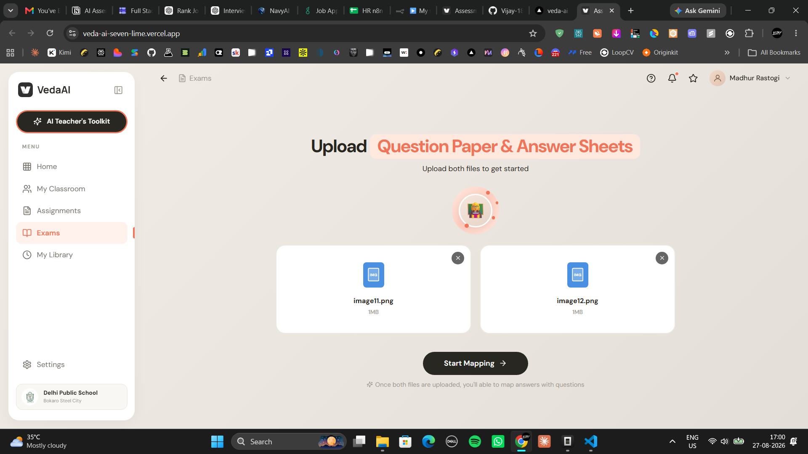
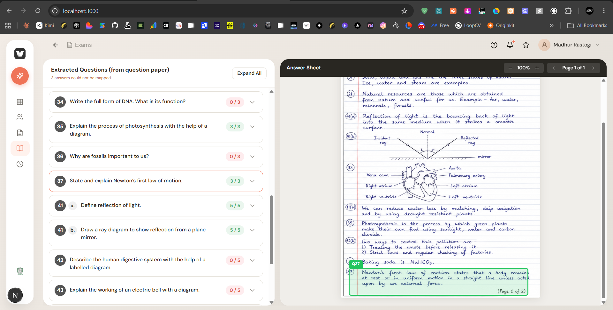
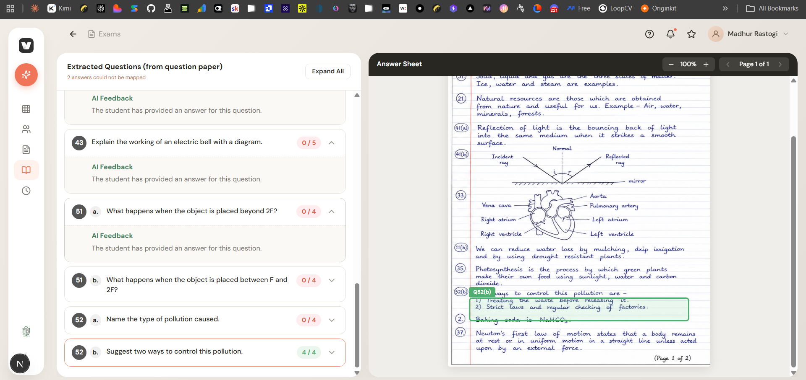
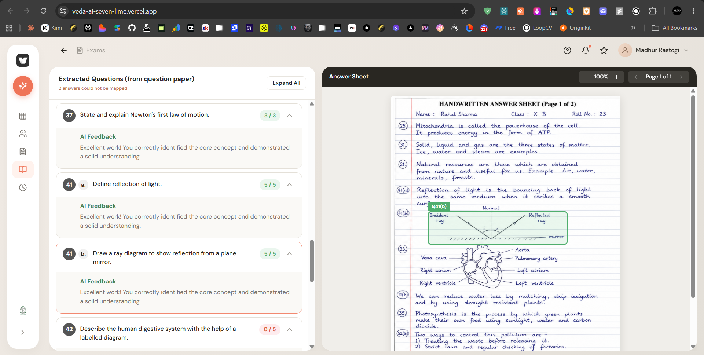
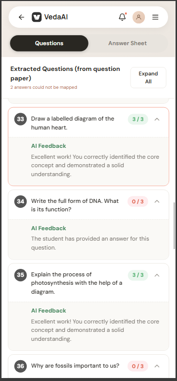
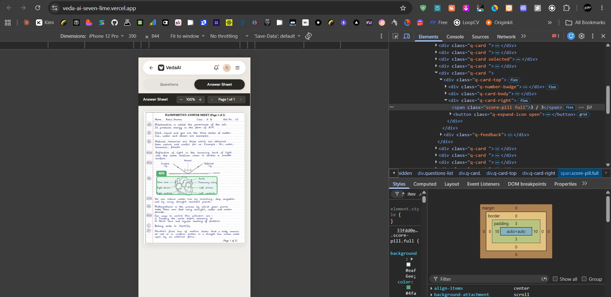

# VedaAI Assessment Mapper

## Output Images

The following images demonstrate the extraction pipeline results:

| Question Paper | Answer Sheet | Extraction Result |
|----------------|--------------|-------------------|
|  |  |  |

| Question Extraction | Answer Extraction | Mapped Results |
|---------------------|-------------------|----------------|
|  |  |  |

*Images 1-5 show the question paper, answer sheet, extraction results, question extraction, and answer extraction. Image 7 shows the final mapped results with highlighted regions.*

A Next.js hiring-assignment application that extracts questions from a question paper, extracts handwritten answers, maps answers to questions, and renders normalized answer-region highlights over PDF or image pages.

## Architecture

- Next.js App Router, React, TypeScript, and Tailwind CSS
- PDF.js canvas rendering for uploaded PDFs
- Zod validation for all AI responses and normalized bounding boxes
- In-memory browser/session state only; no database, authentication, or persistent storage
- Server-side provider calls through `app/api/extract/route.ts`
- Client-rendered highlights using normalized `[x1, y1, x2, y2]` coordinates

## Provider Hierarchy

Question and answer extraction use independent ordered fallbacks and stop at the first valid document-level result.

Question order: NavyAI Gemini 2.5 Flash, Ollama Cloud Gemma 4 31B, Ollama Cloud MiniMax M3, Gemini 3.5 Flash, Groq, NaraRouter StepFun, NaraRouter MiniMax, Monyet, then NVIDIA Nemotron Omni.

Answer order: NavyAI Gemini 2.5 Flash, Ollama Cloud Gemma 4 31B, Ollama Cloud MiniMax M3, Gemini 3.5 Flash, Groq, NaraRouter StepFun, NaraRouter MiniMax, Monyet, then NVIDIA Nemotron Omni.

Nemotron OCR v2 is the only specialized OCR engine. It runs conditionally for incomplete extraction or geometry recovery and is never returned as semantic truth. Permanent failures and timeouts skip immediately; only genuine temporary 5xx/network failures receive one short retry.

The first four providers are the verified production path. Groq, NaraRouter, Monyet, and Nemotron Omni remain later best-effort fallbacks because availability and image limits can vary by request. GLM and Conduit are not part of the active workflow.

## Setup

```bash
npm install
copy .env.example .env.local
npm run dev
```

Open `http://localhost:3000`.

## Environment Variables

All provider keys are server-side. Never prefix them with `NEXT_PUBLIC_`.

See `.env.example` for the complete server-side list. Configure only the providers used by your deployment and never prefix a secret with `NEXT_PUBLIC_`.

## Commands

```bash
npm run dev
npm run test
npm run lint
npm run build
npm run test:ui
```

Playwright utilities are also available:

```bash
node scripts/capture-reference-sizes.js
node scripts/compare-png.js
```

## Product Flow

1. Upload a PDF, JPG, JPEG, or PNG question paper and answer sheet (10MB maximum each).
2. The server extracts printed questions in order, preserving subparts such as `11(a)` and `11(b)`.
3. It extracts handwritten answers, page numbers, confidence values, and one or more normalized answer regions.
4. The mapping layer combines explicit normalized numbering, semantic token overlap, page context, and confidence.
5. Selecting a question navigates to its answer page and draws a real HTML overlay over the PDF canvas or image.
6. Multi-region answers expose previous/next continuation navigation.
7. Extracted marks are shown as maximum marks only. The app does not invent awarded scores without an answer key or teacher rubric.

## Privacy

Files are processed for the assessment workflow and are not persisted in a database. This project does not add persistent storage. Provider services may process uploaded content according to their own terms, so the UI does not claim guarantees beyond the implemented application behavior.

## Deployment

Import this repository into Vercel as a Next.js project and configure the variables from `.env.example` in Project Settings. Keep the project root at the repository root. The extraction route uses the Node.js runtime, declares a 120-second maximum duration, and requires no database or filesystem persistence.

## Known Limitations

- Extraction accuracy depends on scan quality, handwriting, model availability, and provider quotas.
- Large or highly multi-page PDFs may approach serverless request-size or execution-duration limits.
- The included `?demo=1` route is for local UI verification only and is not used for real uploads.
- Model IDs in `.env.example` must be available to the configured provider account; unavailable model versions will route to the next configured provider.
- Visual-regression comparison covers all nine supplied reference screenshots. Browser/device chrome and dynamic answer-sheet content must be normalized before strict pixel-perfect thresholds can be meaningful.
